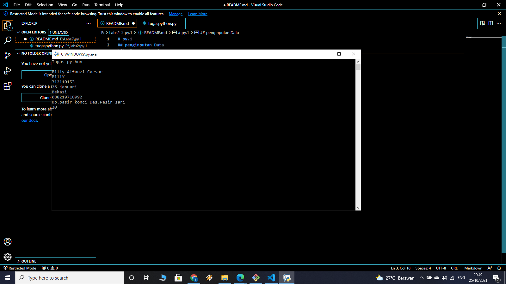

# py.1
## penginputan Data
### Input adalah masukan yang kita berikan ke program.

Program akan memprosesnya dan menampilkan hasil outputnya.Input, proses, dan output adalah inti dari semua program komputer.

